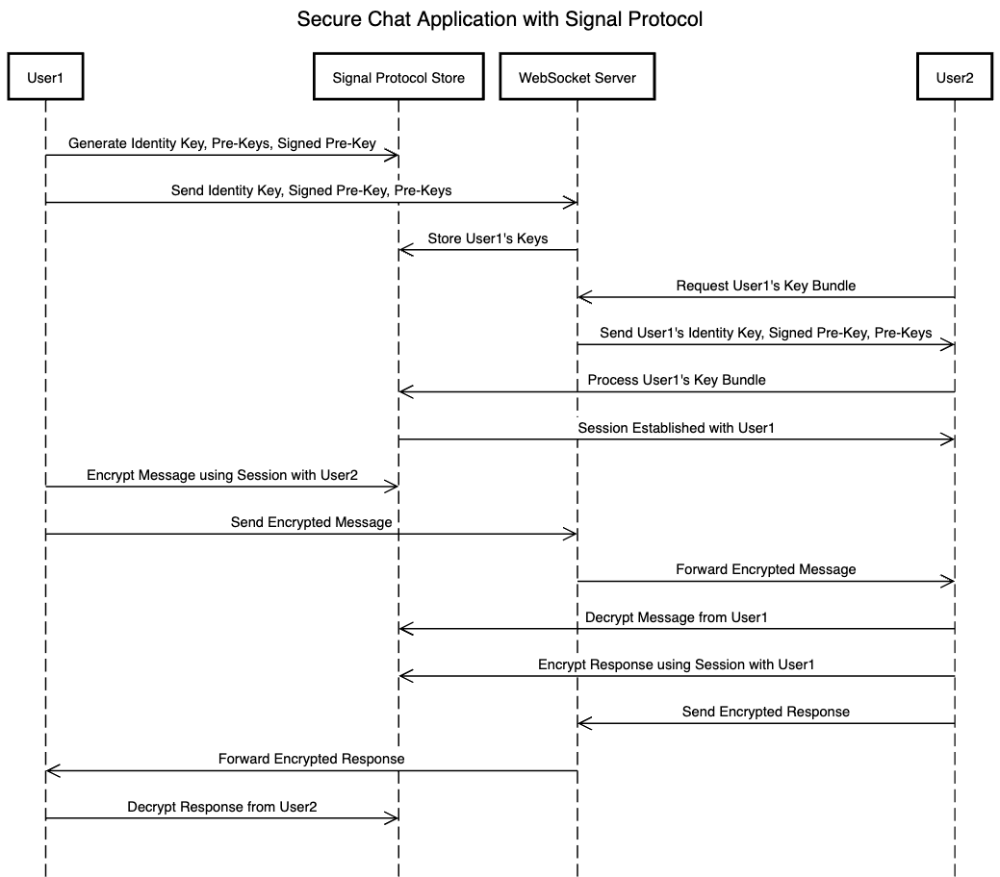

# Secure Chat Application with Signal Protocol

#### This project implements a secure chat application using the Signal Protocol for encrypted communication. The application uses pre-keys, signed pre-keys, and identity keys to establish secure sessions between users, ensuring the privacy and integrity of messages. Real-time communication is achieved through WebSockets, and all messages are encrypted/decrypted using the Signal Protocol.



## Features

- **Identity Key Generation**: Each user generates an identity key pair to uniquely identify themselves.
- **Pre-Key Generation**: Pre-keys are short-lived keys used for establishing secure communication.
- **Signed Pre-Key**: A longer-term key that signs other keys to ensure message authenticity.
- **Session Establishment**: Users can securely exchange messages by setting up encrypted sessions.
- **Message Encryption**: All outgoing messages are encrypted before being sent to the server.
- **Message Decryption**: Incoming messages are decrypted and displayed in the chat interface.
- **Real-Time Communication**: The app uses WebSockets to communicate in real time, with events for user connections, new messages, and other status updates.

## How It Works

1. **User Registration and Initialization**:
    - Users are initialized with a `registrationId` and `deviceId`.
    - Identity keys, pre-keys, and signed pre-keys are generated.
    - The keys are sent to the server for future message exchanges.

2. **Secure Session Establishment**:
    - When two users communicate, the app fetches the pre-key bundle of the recipient and uses it to build a secure session.
    - Sessions are maintained using the Signal Protocol's session management system.

3. **Message Sending**:
    - Messages are encrypted using the recipient's pre-key and identity key.
    - The encrypted message is sent via WebSocket and stored securely on the server.

4. **Message Receiving**:
    - When a message is received, it is decrypted using the session established with the sender.
    - The decrypted message is then displayed in the chat interface.

## Installation

### Prerequisites

- A server to handle WebSocket connections and manage key exchanges.
- A modern web browser that supports WebSockets and JavaScript ES6.

### Steps

1. Clone the repository:

   ```bash
   git clone https://github.com/your-repo/secure-chat-app.git
2.	Install dependencies:
3. Include libsignal-protocol for encryption. 
4. Use a WebSocket server such as socket.io. 
5. Modify the serverBaseUrl in the code to point to your server. 
6. Open index.html in a browser.

How to Use

Starting the Application

1.	User Registration:
2. Enter your unique user token in the input field and click “Connect”.
3. This will initialize the user with a registrationId and deviceId, and generate necessary keys.
4. Sending Messages:
5. Type a message in the input field and click “Send”.
6. The message will be encrypted and sent to all connected users.
7. Receiving Messages:	
8. When another user sends a message, it will be automatically decrypted and displayed in the chat.

Key Components

Signal Protocol

	•	Identity Key: A unique long-term key that identifies the user.
	•	Pre-Keys: Short-term keys used for secure communication.
	•	Signed Pre-Key: A key that signs pre-keys, ensuring message authenticity.
	•	Session Management: Each user establishes and maintains a session with each contact, encrypting and decrypting messages using the session’s cryptographic keys.

WebSocket Events

	•	MESSAGE: Sent when a user sends a message.
	•	WELCOME: A welcome message from the server when the user connects.
	•	NEW_USER: Event triggered when a new user joins the chat.
	•	DISCONNECT: Event triggered when a user disconnects from the server.

Code Overview

Key Files

	•	wallet.js: Contains the Signal Protocol logic for key generation, session setup, and message encryption/decryption.
	•	index.html: The front-end of the chat application, containing the user interface and buttons for sending/receiving messages.

Core Functions

	•	initUser(registrationId, deviceId): Initializes the user by generating identity and pre-keys and sending them to the server.
	•	generatePreKeys(registrationId): Generates pre-keys for secure communication.
	•	sendKeysToServer(): Sends identity keys, signed pre-keys, and pre-keys to the server.
	•	sendMessageToServer(message, messageToObject): Encrypts a message using the recipient’s session and sends it via WebSocket.
	•	processIncomingMessage(incomingMessageObj): Decrypts incoming messages using the sender’s pre-key.

Dependencies

	•	Signal Protocol: Used for generating cryptographic keys and securing communication.
	•	WebSocket (socket.io): For real-time communication between clients.

Future Enhancements

	•	Authentication: Add user authentication to secure user accounts.
	•	Message History: Implement message storage and retrieval from the server for chat history.
	•	Multi-Device Support: Support secure communication across multiple devices for each user.

License

This project is licensed under the MIT License.